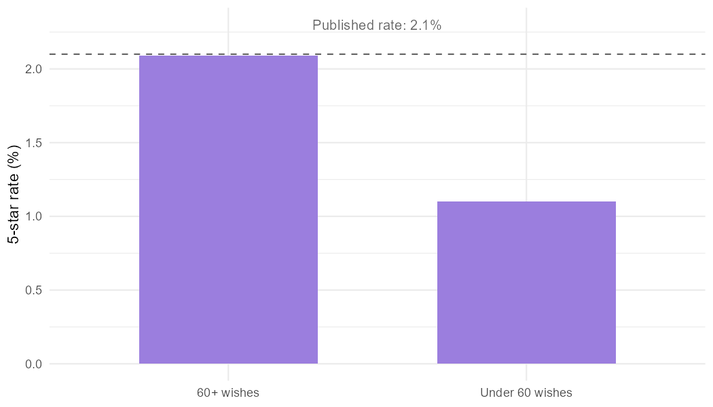
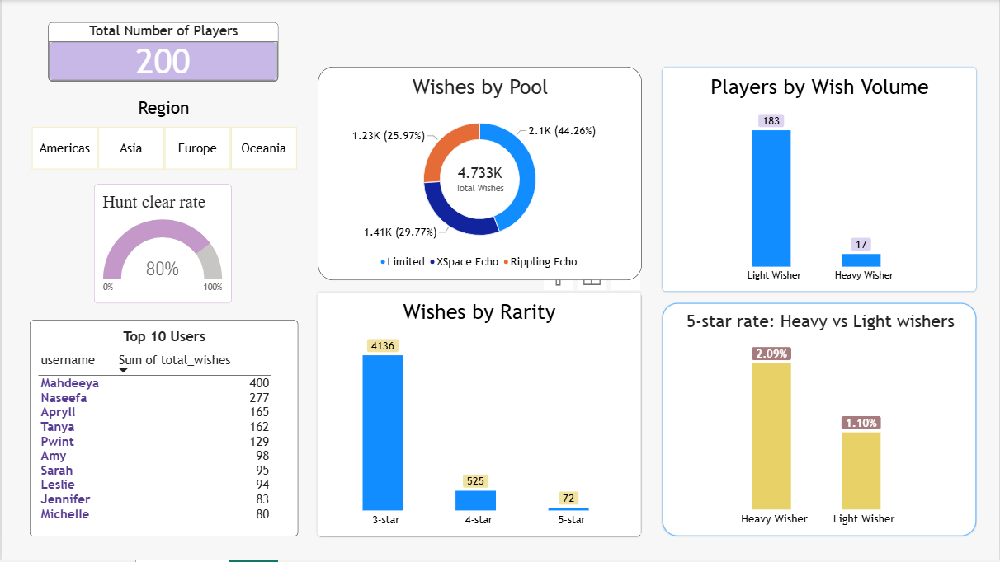

# Love and Deepspace — Synthetic Dataset & SQL Analysis

A relational dataset I built from scratch in R and analyzed in MySQL, modelled on Love and Deepspace — a mobile game I play. 
I built this to utilize SQL using data applicable to real life. 

# Background (Very Simplified)

Love and Deepspace is a mobile game where players collect Memories — character cards that unlock story content and boost combat stats. 
Memories are obtained by making a wish (gacha pulling mechanism), which costs in-game currency and returns a random card at one of three rarity tiers: 
- 3-star (common)
- 4-star (uncommon)
- 5-star (rare)
  
The odds are low: a 5-star has a 1% base chance per wish. 
To stop unlucky players from getting nothing, the game uses a pity system:
- After 60 wishes without pulling a 5-star, the odds climb with each wish until a 5-star is guaranteed at wish 70.
- A 4-star is guaranteed at least every 10 wishes. Pulling a card resets its counter.

Players also fight bosses in Bounty Hunt. The highest clear (win) is 3 stars: 
- one star for clearing
- one for finishing with at least 50% HP
- and one for clearing in under 90 seconds

# The data (csv files)
| Table	| Rows | What it holds |
|---|---|---|
[`players`](love_and_deepspace/data/players.csv)	| 200	| player_id, username, region, join_date |
[`hunts`](love_and_deepspace/data/hunts.csv)	| 2,000 |	 a single Bounty Hunt attempt —> wanderer, stage, companion, cleared, hp_left_pct, clear_secs, stars |
[`wishes`](love_and_deepspace/data/wishes.csv) |	4,733 |	one wish per player —> rarity, pool, currency, wish_number |

Note: each row in hunts is one attempt at a Bounty Hunt stage — one fight, by one player.

All three tables are linked by player_id.

# How it was built

Everything is generated in [`gaming_data.R`](love_and_deepspace/R/gaming_data.R) with set.seed() so the dataset is reproducible.
Considerations made when building this data:

**Activity can't predate signup:** 
> A helper function takes each player's signup date and generates event dates on or after it, so nobody has a hunt or wish recorded before they joined.

**Wish (pull) counts follow a whale distribution:** 
> Real gacha spending is long-tailed — most players pull a little, a few pull enormously — so pull counts are drawn from a log-normal distribution rather than an even spread. The median player makes about 12 wishes; the heaviest hit the 400 cap.

**Pity is actually simulated:** 
> Rather than drawing rarities independently at the published rates, each player's wishes are generated in sequence with counters tracking how long they've gone without each tier. The 5-star chance stays at 1% until wish 60, then climbs 10 points per wish to a guaranteed hit at 70.

# Findings
The advertised 5-star rate only applies to heavy spenders.

Across all wishes, the observed 5-star rate was 1.52% — below the game's published 2.1%. Splitting players by volume explains the gap:
| Group | Players | 5-star rate |
|---|---|---|
| 60+ wishes | 17 (8.5%) | 2.09% |
| Under 60 wishes | 183 (91.5%) | 1.10% |

**Figure 1. Players who wish enough to trigger pity reach the published 5-star rate; lighter pullers stay at the base rate.**

Heavy pullers land almost exactly on the published figure. Everyone else sits at the base rate, because pity never activates for them. The advertised number describes the whales, not the median player.

# Report in fixing bugs/issues
A sorting step broke the pity sequence.

Querying the gaps between 5-stars turned up a maximum of 97 wishes — impossible, since hard pity caps it at 70. Three rows violated the limit.

The cause wasn't the pity simulation. Verifying the function in isolation gave a maximum gap of 63, within the cap. The problem was a later step: wish dates were generated randomly, then the rows were sorted by date and renumbered. The rarities kept their original sequence, but the numbers describing that sequence were reassigned to different rows.

The fix was to stop sorting the rows and sort only the dates within each player, so wish 1 is both the first pull and the earliest date. After the fix, the maximum gap dropped to 68 — and R and MySQL returned the same number independently.

# Interactive Dashboard

An interactive view of the same three tables. It shows total players, the hunt clear rate, how wishes split across pools and rarity tiers, the top ten wishers, and the 5-star rate for heavy versus light wishers side by side.

Selecting a region, a wish volume group, or a player from the top-ten table filters every other visual to that selection. Click here to try [LDS DASHBOARD](love_and_deepspace/powerbi/LDS_Dashboard.pbix)

# Limitations/ Disclaimers 
- Pity is tracked per player, not per pool: In the real game, wish pools of the same type share a pity counter separately. This model uses one counter per player.
- No difficulty relationship: Wanderer and stage are drawn independently of whether a hunt is cleared, so comparative queries like "which boss is hardest" return noise. Only volume and distribution queries are included for hunts for that reason.
- Companion choice is uniform. Players have no favourite, so companion-level comparisons aren't meaningful.
- Shards, Heartsand, Blessings, and Galaxy Explorer are out of scope. (These are other things in the game that I did not include due to it's complexity and dynamic)
- This dataset is very simplified for querying purposes.
- The dashboard's region filter demonstrates interaction, not a finding. Region was sampled independently of every other variable, so filtering by it shows only random variation.
  
# Files
- [gaming_data.R](love_and_deepspace/R/gaming_data.R) — generates all three tables
- [data](love_and_deepspace/data) — the exported CSVs
- [queries.sql](love_and_deepspace/SQL/queries.sql) — every query, with comments on what each one answers
- [LDS_dashboard.pbix](love_and_deepspace/powerbi/LDS_Dashboard.pbix) — interactive dashboard 

# Tools
R packages (tidyverse, randomNames), MySQL 8.0, MySQL Workbench, Power BI
